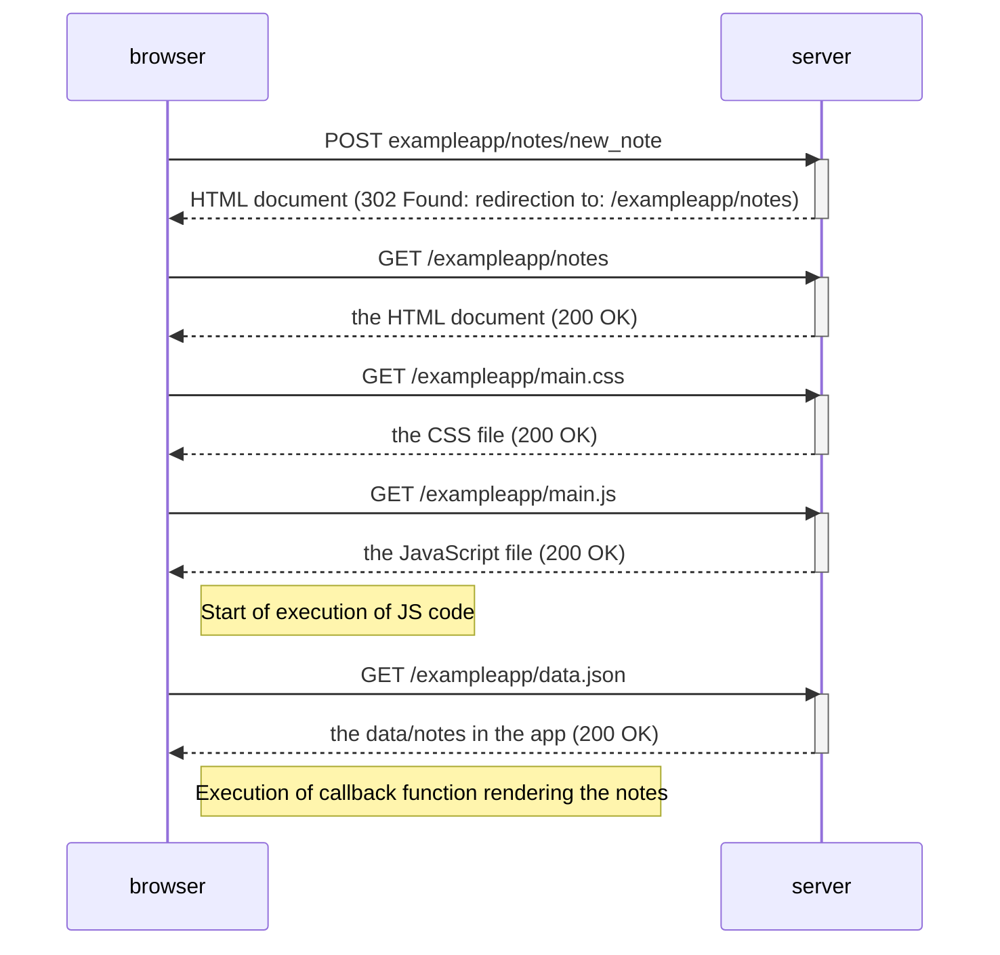

```mermaid
sequenceDiagram
    participant browser
    participant server

    browser->>server: POST exampleapp/notes/new_note
    activate server
    server-->>browser: HTML document (302 Found: redirection to: /exampleapp/notes)
    deactivate server

    browser->>server: GET /exampleapp/notes
    activate server 
    server-->>browser: the HTML document (200 OK)
    deactivate server

    browser->>server: GET /exampleapp/main.css
    activate server
    server-->>browser: the CSS file (200 OK)
    deactivate server

    browser->>server: GET /exampleapp/main.js
    activate server
    server-->>browser: the JavaScript file (200 OK)
    deactivate server

    Note right of browser: Start of execution of JS code

    browser->>server: GET /exampleapp/data.json
    activate server
    server-->>browser: the data/notes in the app (200 OK)
    deactivate server

    Note right of browser: Execution of callback function rendering the notes
```