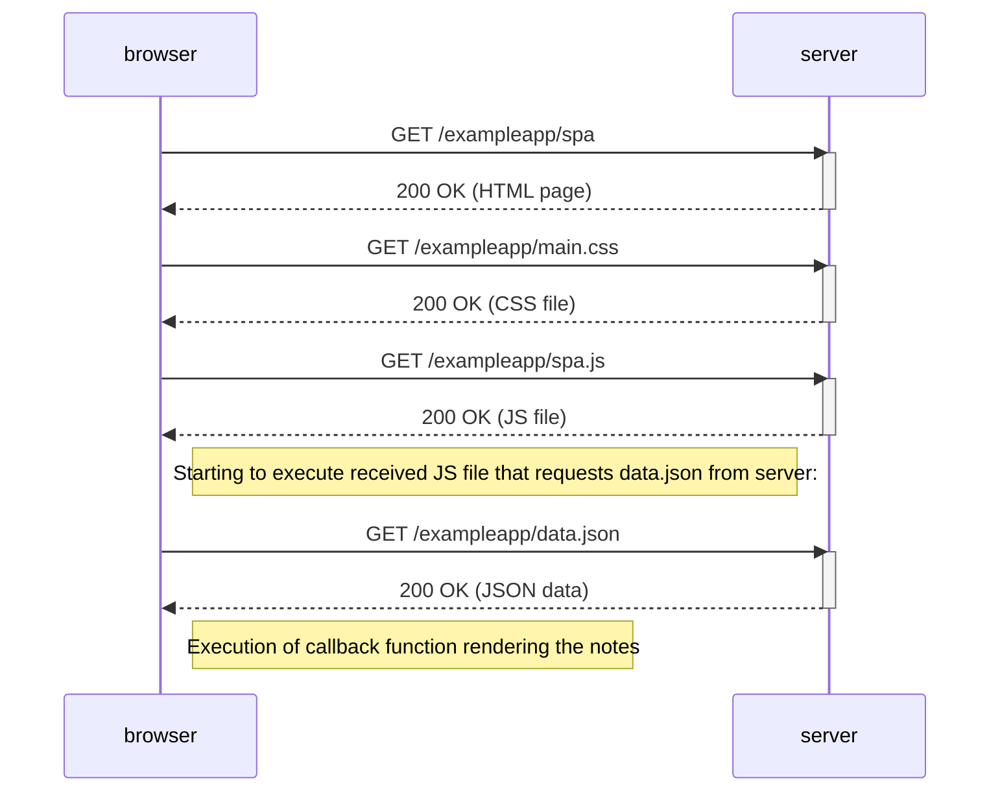

```mermaid
sequenceDiagram
    participant browser
    participant server

    browser->>server: GET /exampleapp/spa
    activate server
    server-->>browser: 200 OK (HTML page)
    deactivate server

    browser->>server: GET /exampleapp/main.css
    activate server
    server-->>browser: 200 OK (CSS file)
    deactivate server

    browser->>server: GET /exampleapp/spa.js
    activate server
    server-->>browser: 200 OK (JS file)
    deactivate server

    Note right of browser: Starting to execute received JS file that requests data.json from server:

    browser->>server: GET /exampleapp/data.json
    activate server
    server-->>browser: 200 OK (JSON data)
    deactivate server

    Note right of browser: Execution of callback function rendering the notes

```